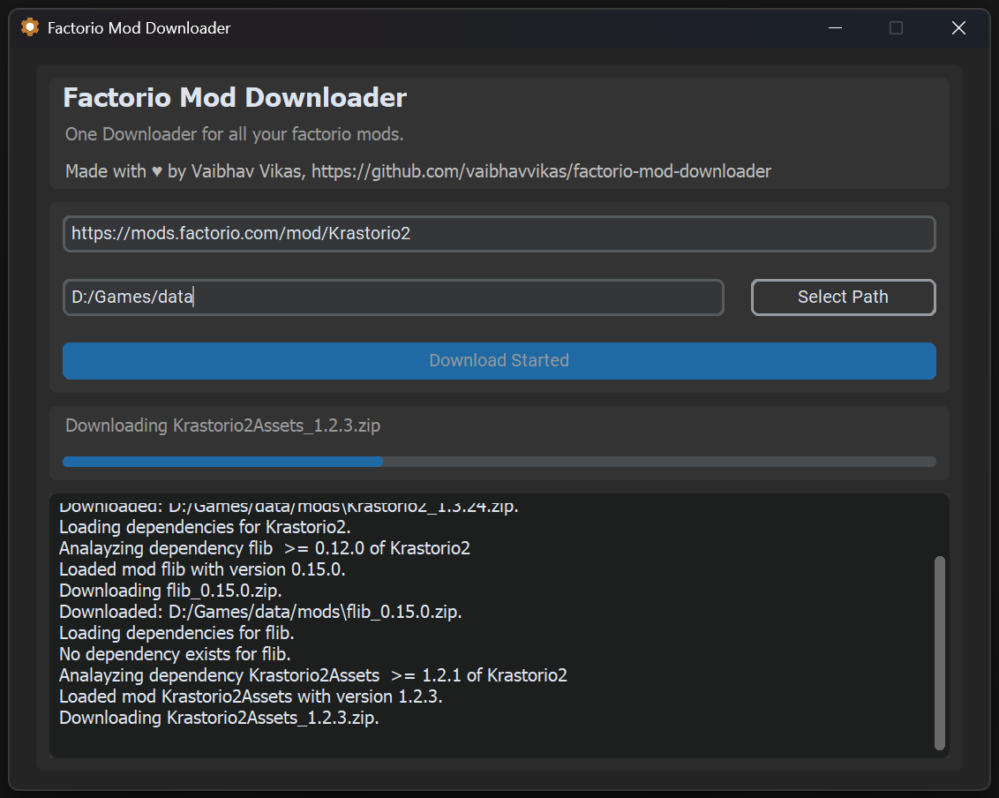

# Factorio Mod Downloader

Factorio mod downloader, recursively downloads a mod and its all required dependencies. No hassle, no login required. Just put the mod url and select the path. Thats all.

It is really helpful if you want to download a mod or modpack containing various different recommended mods, that if you want to download separately will take you a lot of clicks and headache.

**If you love the game please buy it and support the developers. I am a big fan of the game.**

[Official Factorio Link](https://factorio.com)

### Features
1. Added Dark Mode
2. Added progress bars and logs to see what files are being downloaded.
3. Completely interactive and requires no other dependency. 100% standalone app.

### How to download
1. Go to [Releases](https://github.com/vaibhavvikas/factorio-mod-downloader/releases/latest) 
2. Download the latest executable i.e. **\*.exe file** from the latest version added inside the assets dropdown. Latest release version is mentioned on the top of README.md file.

### How to run
1. Run the app, select the directory and add mod url from official [factorio mod portal](https://mods.factorio.com/) for e.g. URL for Krastorio 2 mod is: `https://mods.factorio.com/mod/Krastorio2`.
2. Click on Download button.
3. The application will start downloading the mods and show the status and progress in the corresponding sections.
4. The first step of loading dependencies take some time as it download [chromium-drivers](https://github.com/yeongbin-jo/python-chromedriver-autoinstaller) (~30-35 MB) required for loading URLs and the mods for downloading.
5. Once completed the application will show a download complete dialog.

### Development
1. You can build and run the app yourself. I have written the code in python and implemented poetry for dependency management and easy build.
2. Install python > v3.12 and install poetry, refer to [poetry official website](https://python-poetry.org/docs/#installation) for installation guide.
3. Install dependencies via the command `poetry install`.
4. To run the application use the command `poetry run factorio-mod-downloader`. This will run the application directly without building.
5. To build the application, I am using pyinstaller (you need a **Windows x64** system to build it). Run the command `poetry build` to build the application. A new .exe file will be generated inside `/dist/pyinstaller/win_amd64`.

### Note
I have not included optional dependencies, as its a stupid idea, since a lots of mods, even they don't need something have optional dependencies mentioned. So it will probably take forever to finish downloading. It can be implemented although. Not a big task.

Also, download speed is based on re146, Its not super fast but its fine.

Feel free to reach out to me or start a message in the discussions tab if you need some help. 

### Credits:
- re146.dev
- [radioegor146](https://github.com/radioegor146)

