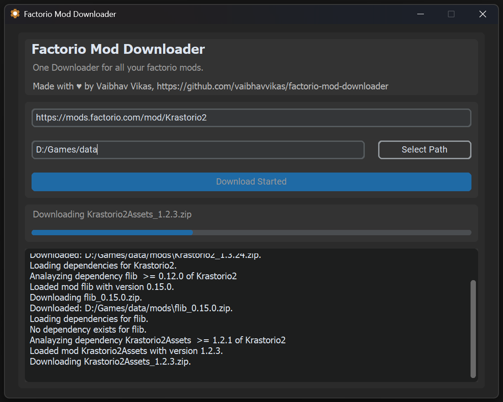

# Factorio Mod Downloader

Factorio mod downloader, recursively downloads a mod and its all required dependencies. No hassle, no login required. Just put the mod url and select the path. Thats all.

It is really helpful if you want to download a mod or modpack containing various different recommended mods, that if you want to download separately will take you a lot of clicks and headache.

**If you love the game please buy it and support the developers. I am a big fan of the game.**

[Official Factorio Link](https://factorio.com)

### Features (In Development)
1. Revamp app with re-written code with Rust
2. New design with version selection and mod selection
3. Dependency management
4. Cli support
5. Cross platform support

### How to download
1. Go to [Releases](https://github.com/vaibhavvikas/factorio-mod-downloader/releases/latest) 
2. Download the latest executable i.e. **\*.exe file** from the latest version added inside the assets dropdown. Latest release version is mentioned on the top of README.md file.

### How to run
1. Run the app, select the directory and add mod url from official [factorio mod portal](https://mods.factorio.com/) for e.g. URL for Krastorio 2 mod is: `https://mods.factorio.com/mod/Krastorio2`.
2. Click on Download button.
3. The application will start downloading the mods and show the status and progress in the corresponding sections.
4. The first step of loading dependencies take some time as it download [chromium-drivers](https://github.com/yeongbin-jo/python-chromedriver-autoinstaller) (~30-35 MB) required for loading URLs and the mods for downloading.
5. Once completed the application will show a download complete dialog.

### Note
Feel free to reach out to me or start a message in the discussions tab if you need some help. 

### Credits:
- re146.dev
- [radioegor146](https://github.com/radioegor146)

