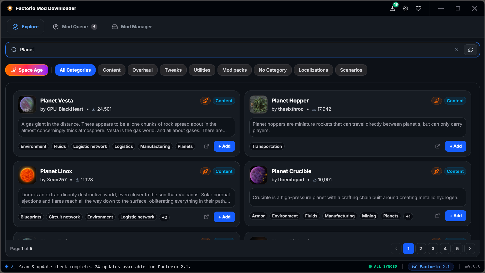
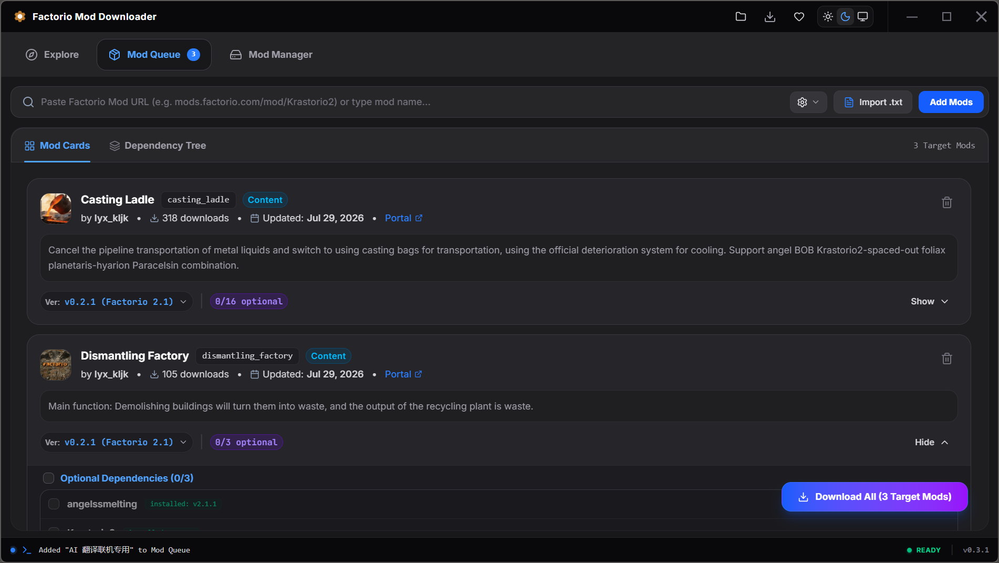
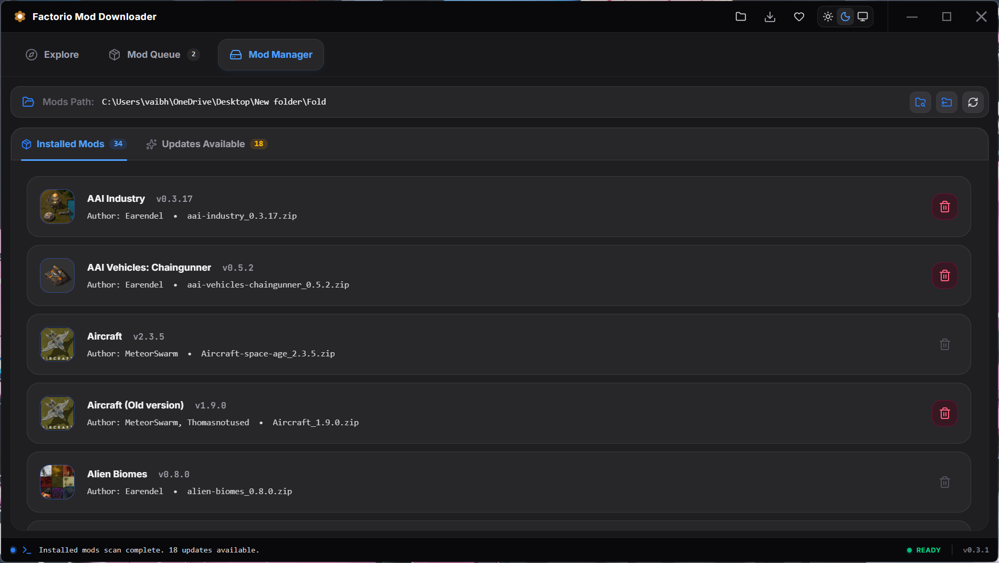

# Factorio Mod Downloader

[](https://github.com/vaibhavvikas/factorio-mod-downloader/releases)

[](https://opensource.org/licenses/MIT)

**Factorio Mod Downloader** is a high-performance cross-platform desktop application built in **100% Rust and Tauri v2**. It recursively resolves mod dependency trees, fetches compatibility requirements, and downloads full modpacks in parallel—**no browser drivers, no python scripts, and no login required**.

Simply search online mods, paste a Factorio Mod Portal URL or mod ID, inspect version constraints and optional dependencies, and click **Download All**.

> **Note**: *If you love Factorio, please support Wube Software by purchasing the game at [factorio.com](https://factorio.com).*

---

## 📸 Screenshots

| **🔍 Explore & Online Search** |
|:---:|
|  |

| **🌳 Dependency Resolver & Queue** | **📦 Installed Mod Manager** |
|:---:|:---:|
|  |  |

---

## ✨ Features

- **🚀 100% Native Rust Performance**: Built with a modular Rust workspace (`factorio`, `parser`, `downloader`, `cli`, and `gui`). Zero browser automation drivers needed.
- **🔍 Online Explore & Category Search**: Browse Factorio Mod Portal releases with real-time text search, version selection (2.1, 2.0, 1.1, etc.), category filters (*Library*, *Logistics*, *Space Age*), and smart description tooltips.
- **🌳 Recursive Dependency Graph Resolver**: Automatically resolves required, recommended, and optional dependencies for complex overhauls (*Krastorio 2*, *Space Age*, *Freight Forwarding*, etc.). Toggle between **Mod Cards** and interactive **Dependency Tree** graph view.
- **📦 Installed Mod Manager & One-Click Updates**: Automatically scan your installed mods folder, compute reverse dependency locks, detect online updates, and resolve batch updates safely.
- **⚙️ Custom Version Selection & Toggles**: Fine-tune specific mod version releases and toggle optional or recommended dependencies per mod.
- **🔄 Parallel Download Manager**: Multi-threaded parallel downloading with streaming speed indicators, exact file sizes, and inactivity timeout guards.
- **🔁 Auto-Retry & Recovery**: Automatic 3-attempt retry loop for interrupted downloads, plus manual one-click **Retry** buttons for failed items.
- **🎨 Modern Design System & GPU Animations**: Glassmorphic theme tokens, light/dark mode support, hardware-accelerated GPU transitions, and fluid window scaling.
- **🌐 Direct Standalone Executables**: Native portable binaries for **Windows (x64 .exe)**, **macOS (Universal Binary)**, and **Linux (x86_64 ELF)**—no installation or setup wizard required.

---

## 🖥️ How to Use

1. Download the direct executable or archive for your OS from the [Releases](https://github.com/vaibhavvikas/factorio-mod-downloader/releases/latest) page.
2. Launch **Factorio Mod Downloader**:
   - **🪟 Windows**: Double-click `factorio-mod-downloader-gui-windows-x64.exe`.
   - **🍎 macOS**: Unzip `factorio-mod-downloader-gui-macos-universal.app.zip` and double-click `Factorio Mod Downloader.app`.
   - **🐧 Linux**: Extract the `.tar.gz` archive, grant executable permission, and run:
     ```bash
     tar -xzvf factorio-mod-downloader-gui-*-linux-x64.tar.gz
     chmod +x factorio-mod-downloader-gui-linux-x64
     ./factorio-mod-downloader-gui-linux-x64
     ```
     > 💡 **Linux Dependency Note**: Tauri desktop applications on Linux require WebKitGTK 4.1. If you get a missing `libwebkit2gtk-4.1.so.0` error, install it using your package manager:
     > - **Ubuntu / Debian / Mint**: `sudo apt update && sudo apt install -y libwebkit2gtk-4.1-0 libgtk-3-0`
     > - **Fedora / RHEL**: `sudo dnf install webkit2gtk4.1 gtk3`
     > - **Arch Linux / Manjaro**: `sudo pacman -S webkit2gtk-4.1 gtk3`
3. Set your target **Mods Folder** (automatically detected on boot).
4. Browse mods in the **Explore** tab or paste a mod URL (e.g., `https://mods.factorio.com/mod/Krastorio2`) in the **Mod Queue**.
5. Adjust versions or optional dependencies if needed, then click **Download All**.
6. Monitor progress in real time via the **Download Manager** drawer!

---

## 🛠️ Project Workspace Architecture

```
.
├── apps/
│   ├── cli/             # Standalone Rust CLI runner (planned)
│   └── gui/             # Tauri v2 Desktop GUI (Rust + React + Vite + TailwindCSS)
├── crates/
│   ├── factorio/        # Factorio Mod Portal API client & dependency graph resolver
│   ├── parser/          # Info.json dependency parser & version constraint evaluator
│   └── downloader/      # Multi-threaded parallel downloader engine with timeout/retries
└── Cargo.toml           # Root Cargo workspace manifest
```

---

## 🏗️ Building from Source

### Prerequisites
- [Rust](https://www.rust-lang.org/tools/install) (1.75+)
- [Node.js](https://nodejs.org/) (v24+)
- Platform build toolchains (Xcode tools for macOS, Visual Studio C++ build tools for Windows, or `libgtk-3-dev` / `libwebkit2gtk-4.1-dev` for Linux).

### Build Desktop GUI
```bash
# Clone the repository
git clone https://github.com/vaibhavvikas/factorio-mod-downloader.git
cd factorio-mod-downloader/apps/gui

# Install npm dependencies
npm install

# Run in Development Mode
npx tauri dev

# Build Production Bundle
npx tauri build
```

---

## 💳 Credits & Acknowledgments
- Factorio Mod Portal API & [Factorio.com](https://factorio.com) by Wube Software.
- Community storage mirrors by [re146.dev](https://re146.dev) & [@radioegor146](https://github.com/radioegor146).

---

## ⚠️ Disclaimer
*Factorio Mod Downloader* is an independent, community-developed open-source software and is **not developed by, affiliated with, or endorsed by Wube Software**. Factorio and all associated game logos, trademarks, and assets belong to Wube Software.

---

## 📄 License
Distributed under the [MIT License](LICENSE).

